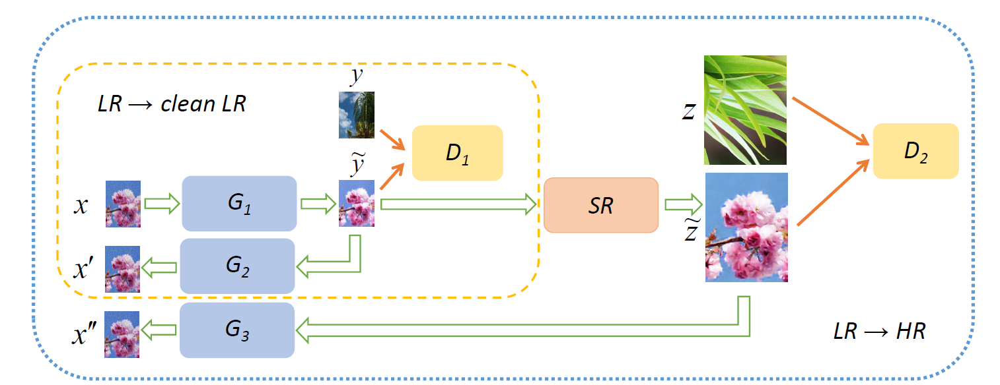

# CinCGAN
Unofficial implementation of the model proposed in *Unsupervised Image Super-Resolution using Cycle-in-Cycle Generative Adversarial Networks* by Yuan *et al.*

Master's thesis for the Degree *ICT for Internet and Multimedia*, University of Padova. 

## Authors

* **Davide Boem** - [boemd](https://github.com/boemd) - [davideboem.com](https://davideboem.com/)

### Model 

The model in the picture consists in two nested CycleGAN-line networks. The inner model performs denoising and deblurring and the outer one performs super-resolution.

At first it is necessary to pre-train the inner model for 400000 iterations. Then it is the turn of the EDSR network, which has to be trained for 1000000 iterations.

Finally it is possible to fine tune the whole model by uploading the weights of the pre-trained nets.

The two cycles are trained in order to minimize a linear combination of four losses (each).
The losses are: 
* Generator Adversarial loss: to fool the discriminator and to produce realistic samples;
* Cycle Consistency loss: to mantain the consistency between input and output (this loss allows the train to be unsupervised);
* Identity loss: to avoid color variations among different iterations;
* Total Variation loss: to impose spatial smoothness.

